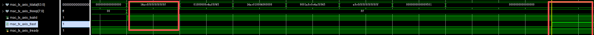

# 🌐 10Gbps UDP/IP Protocol Stack for FPGA

[]()
[]()
[]()

---

## 🧩 UDP 协议简介

### 1️⃣ 概述

**UDP（User Datagram Protocol，用户数据报协议）** 是一种 **无连接、尽最大努力交付的传输层协议**。  
相比 TCP，UDP 具有以下特点：

- **无连接**：发送数据前不需建立连接  
- **不保证可靠性**：不重传丢包、不保证顺序  
- **开销小、延迟低**：首部短、处理快，适用于实时应用

---

### 2️⃣ UDP 特点

| 特性           | 描述                               |
| :------------- | :--------------------------------- |
| 面向报文       | 每个 UDP 报文独立传输，互不依赖    |
| 无连接         | 无需三次握手，直接发送数据         |
| 不可靠传输     | 丢包、乱序、重复需应用层处理       |
| 低开销、高速   | UDP 头仅 8 字节，适合实时传输      |
| 支持广播和多播 | 可发送到广播或组播地址，一对多传输 |

---

### 3️⃣ UDP 数据报结构

UDP 报文由 **首部 (8 Bytes)** + **数据部分** 组成：

| 字段                  | 长度 | 说明              |
| --------------------- | ---- | ----------------- |
| 源端口（Source Port） | 2 B  | 发送端端口号      |
| 目的端口（Dest Port） | 2 B  | 接收端端口号      |
| 长度（Length）        | 2 B  | UDP头 + 数据长度  |
| 校验和（Checksum）    | 2 B  | 校验UDP数据完整性 |

**数据部分（Payload）**  
存放应用层数据，最大长度 = MTU - IP头 - UDP头。

---

### 4️⃣ UDP 工作流程

1. **发送方：**
   - 应用层传数据 → UDP 封装首部 → 交给 IP 层
2. **网络传输：**
   - 数据通过 IP/Ethernet 传输，不保证顺序和可靠性
3. **接收方：**
   - IP 层接收后交给 UDP → 按端口号转交应用层

---

### 5️⃣ UDP 应用场景

- 🔊 实时通信（语音、视频会议）  
- 🎮 在线游戏（低延迟传输）  
- 📡 流媒体（直播、音频）  
- 💡 广播/组播（如 DHCP、发现服务）

---

## ⚙️ FPGA UDP/IP Stack 架构

该工程基于 **IEEE 802.3 标准**，实现了 UDP/IP 协议栈并支持：
- **ARP、IPv4、ICMP、UDP**
- **UDP 校验和计算与验证**
- **10Gbps 以太网传输**
- **AXI4-Stream 接口（64bit / 156.25MHz）**

协议栈结构如下：

    +---------------------------+
    |     User Application      |
    |   (AXI4-Stream Interface) |
    +------------+--------------+
                 |
                 v
    +---------------------------+
    |         UDP Layer         |
    | (Header, Checksum, RX/TX) |
    +------------+--------------+
                 |
    +------------v--------------+
    |         IPv4 Layer        |
    | (Header parse, Checksum)  |
    +------------+--------------+
                 |
    +------------v--------------+
    |      ARP / ICMP Layer     |
    +------------+--------------+
                 |
    +------------v--------------+
    |     10G Ethernet MAC IP   |
    +---------------------------+

---

## 🧰 Build Flow

```bash
$ cd udp_10Gbps_stack/example/EAP_5P_PCIe
$ make
```

## 🧪 Simulation

### 仿真测试环境基本信息：

```
+----------------+--------------------------------------------+-----------------------------+
| Field          | Description                                | Value                      |
+----------------+--------------------------------------------+-----------------------------+
| SRC_MAC        | Source MAC address (Host)                  | AC:70:12:56:41:23          |
| DST_MAC        | Destination MAC address (FPGA)             | AC:14:45:FF:AF:C4          |
| SRC_IP         | Source IPv4 address (Host)                 | 192.168.1.149              |
| DST_IP         | Destination IPv4 address (FPGA)            | 192.168.1.144              |
| UDP_SRC_PORT   | UDP source port                            | 0x4554 (17748)             |
| UDP_DST_PORT   | UDP destination port                       | 0x8080 (32896)             |
+----------------+--------------------------------------------+-----------------------------+
```

------

### 📁 Python 测试脚本说明

| 脚本文件                  | 描述                                                      |
| ------------------------- | --------------------------------------------------------- |
| `testbench_udp_gen.py`    | 输入测试字符串 → 生成对应的 UDP 测试数据（二进制 ascii）  |
| `testbench_mac_rx_gen.py` | 产生 MAC 层的应答帧（含主机 MAC 地址和回复数据）          |
| `mac_tx_packet_decode.py` | 解析 IP 生成的 MAC 数据包，验证 IP/UDP 校验和功能是否正确 |

------

### 📂 仿真文件路径设置

若文件路径不同，请修改 testbench 文件中的打开路径：

```
#(`CLOCK_PERIOD * 20)
fd = $fopen("../../../../../../../python/udp-tx-data.bin", "rb");
if (fd == 0) begin
    $display("Failed to open file!");
    $finish;
end
fc = $fopen("../../../../../../../python/mac-tx-data.bin", "wb");
if (fc == 0) begin
    $display("Failed to open mac-tx-data.bin!");
    $finish;
end
```

> ⚠️ 运行仿真前请确保 Python 脚本已生成对应的输入数据文件。

------

### 🖥️ 仿真观测要点

1. 执行 `testbench_udp_gen.py` 生成 UDP 输入数据。
2. 启动仿真后，当 `arp-tx-axis` 拉高时表示发送 ARP 请求包。
3. 当帧长度 < 64 Bytes 时，自动填 0 补齐。
4. 观察波形时将 `tdata` 转换为 ASCII 便于验证。

**示例波形：**

执行simulation前，先执行testbench_udp_gen.py文件产生对应的测试数据。执行simulation后，当arp-tx-axis流拉高时，会带动对应的mac-tx-axis流也拉高，此时发送arp请求包。当数据包长度低于64byte时，会自动填0补充。



对应的arp回复报文如下：


此时的udp-rx-axis流如下：


选择一部分展开可以发现字节序反向，但内容并没有问题。


## 🔍 Bitstream Verify

完成 Vivado 综合与实现后，通过下载 bitstream 验证 UDP/IP 栈在 FPGA 上的收发能力。
 可使用 Python 脚本生成测试数据，并通过以太网接口捕获 FPGA 输出进行验证。

------

## 📄 License

This project is released under the **MIT License**.
 See LICENSE for details.

------

## ✨ Author

**salefine  10Gbps UDP/IP Stack for FPGA**
 Developed for AMD/Xilinx platforms
 Contributions and pull requests are welcome.

